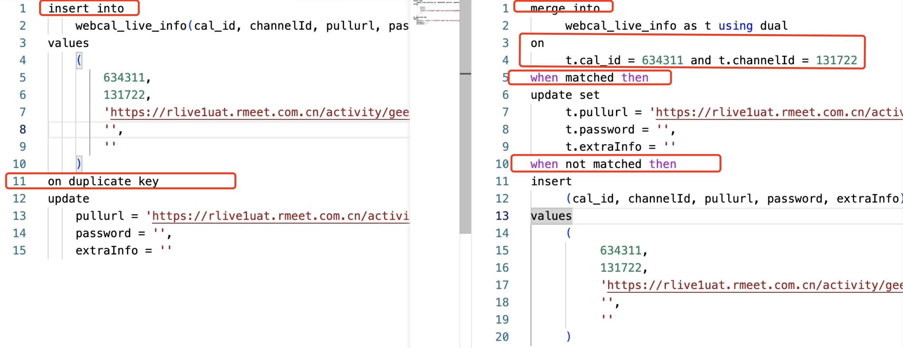
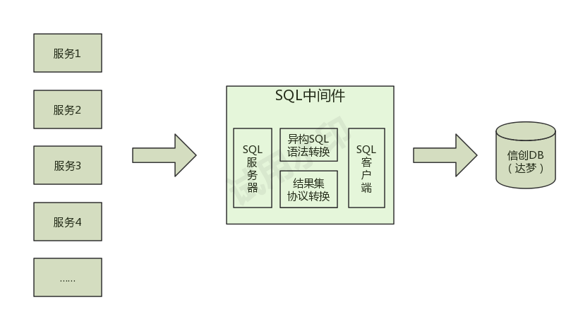
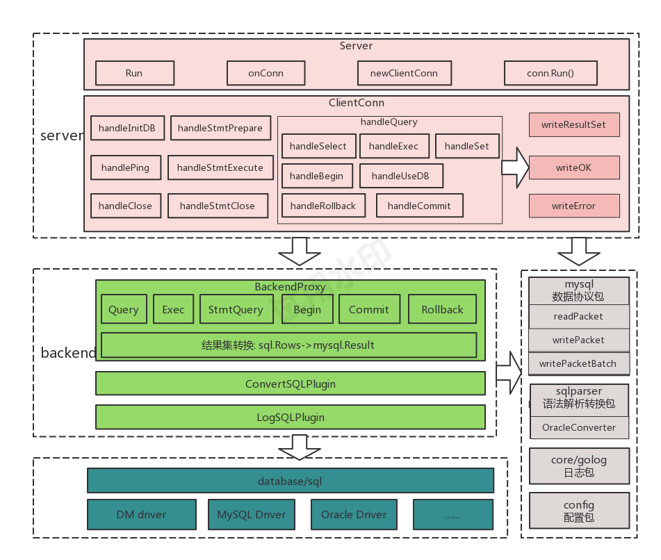
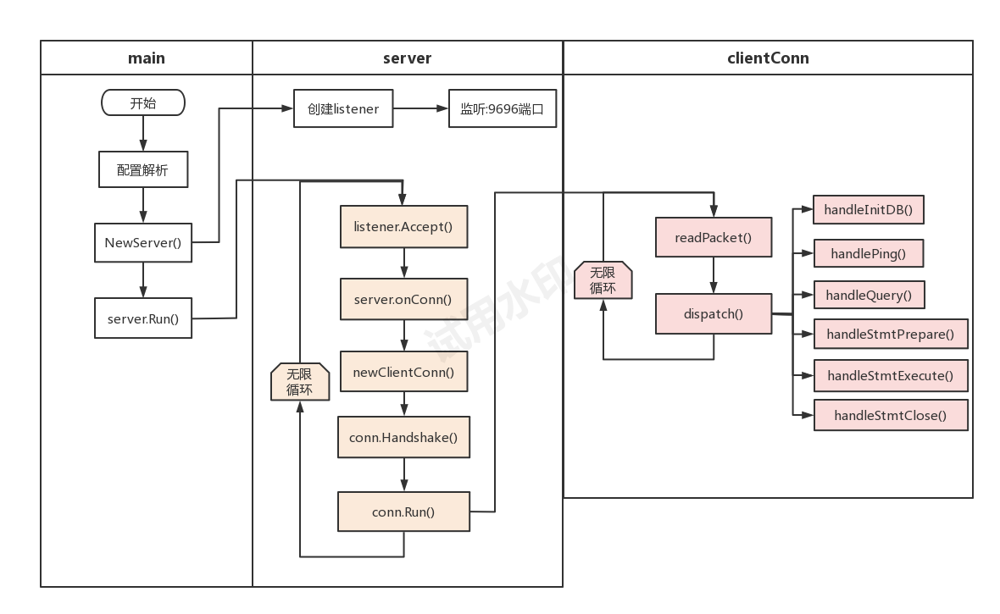
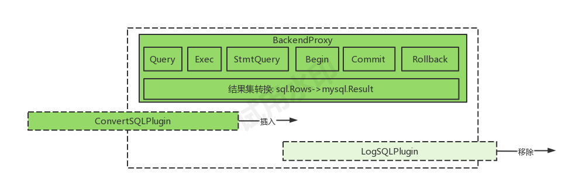
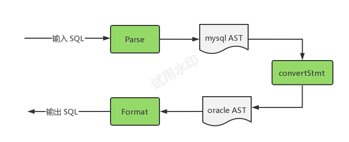
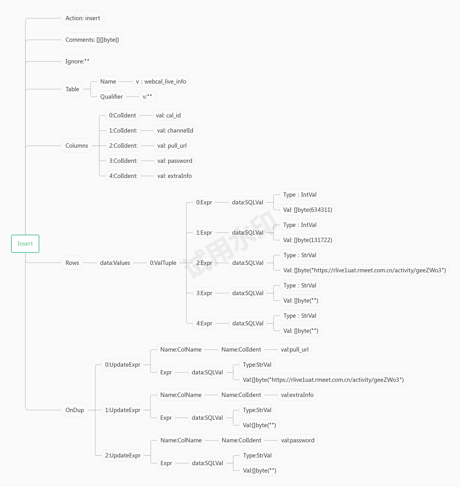
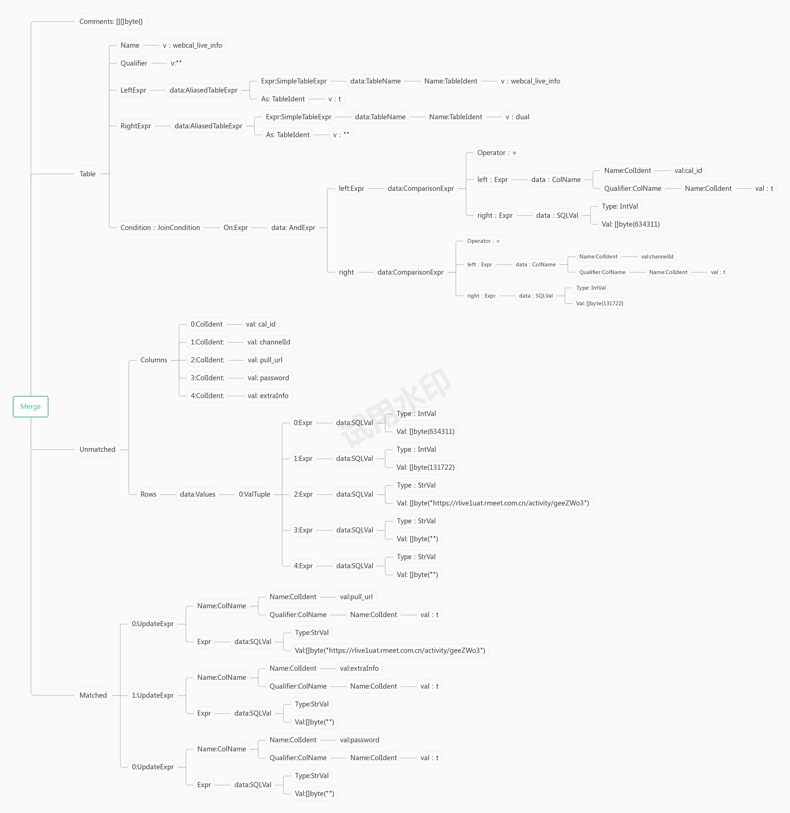
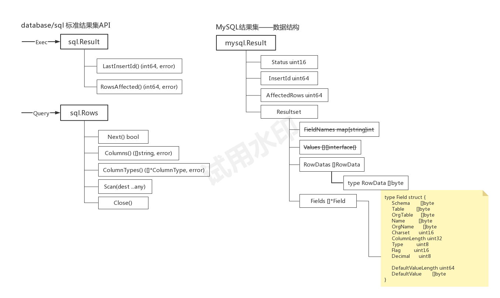

# 1.引言

公司有些私有化项目需要对接基于Oracle的达梦数据库，相关问题也来自于Oracle和Mysql的语法差异，具体对接主要涉及到两类问题：
1. DDL建表语句适配以及存量数据的迁移——运维同学已经搞定，这里不作展开； 
2. 现有系统中40多个服务用到的DML增删改查语句对达梦DB的适配； 

DML语句的适配也可以简单分为两类问题：

1. 简单用字符串替换能解决的
   - 不支持反引号：`，需要替换成双引号："
   - 不支持group_concat函数，需要使用达梦中的wm_concat函数代替

2. 语句结构改变需要手动调整SQL的，例如：
   - on duplicate key update  ---> merge into
   - replace into   ---> merge into
   - case when then else

【语法结构调整示例】


鉴于手动修改所有服务的代码去适配另一个数据库不太现实，后期维护也是一个问题，于是就想能不能找一个统一的地方来处理这个适配工作，把适配代码尽量收在一处。

# 2.思路
在尽量少侵入业务的前提下，有两种处理办法：

a. 在orm层作语法替换，让每个服务集成定制的orm库； 
   - 优点：难度小，只需要关心SQL语法替换，后端DB的连接和驱动不涉及； 
   - 缺点：
     - 40多个服务都需要集成定制的ORM库，每次orm库变动所有服务都需要重新出包； 
     - 只能适用于golang, java、php以及其它语言的服务需要重新考虑方案； 
 
b. 写一个中间件，来代理发给mysql的所有请求，在中间件上完成适配工作。这个中间件需要承担如下角色：
  - 服务器：需要接收Mysql驱动的连接及数据包请求； 
  - 语法转换：完成异构数据库的语法替换； 
  - 代理：将CRUD的所有操作转发到后端的dm数据库； 
  - 协议转换：需要将后端dm返回的数据再封装成mysql协议数据包发给Mysql驱动； 
  - 需要支持一个中间件能代理多个数据库； 



由于中间件对整个系统的侵入最小，所以我们优先尝试走中间件的方案。

# 3.设计

调研过多个开源项目，能符合我们需求的有go-mysql-server、 vitess、kingshard, 代码了解下来，vitess过于庞大，go-mysql-server代码不够直观且mysql协议部分依赖其它项目，最后我们选择了基于kingshard作二次开发。

## 3.1 中间件设计
中间件整体采用从上到下的分层依赖结构，几个核心包职责如下：
- server包负责实现一个mysql服务器，代理mysql的连接建立和数据包协议
- backend包负责代理与后端dm数据库的操作交互，采用database/sql（标准接口）+ 数据库驱动来与dm数据库进行交互
- sqlparser包负责sql语法的解析和替换
- mysql包负责将后端dm返回的数据重新封装成mysql协议的数据包； 



## 3.2 server
server部分是基于kingshard的server模块作的二次修改，整体保留了kingshard的函数结构和代码执行流程。
- 先解析后端DB配置，每个DB建立一个BackendProxy代理实例，本质上就是调用sql.Open来创建一个sql.DB实例； 

```
nodes :
- 
    # db alias name
    name : uc_uniform
    # db driver name
    driver_name: dm

    # default max conns for connection pool
    max_conns_limit : 32

    # master represents a real mysql master server 
    datasource : dm://uc_uniform/uc_uniform@192.168.23.216:5236?socketTimeout=10000
```

- 监听9696端口，每accept一个连接，就走onConn开启一个goroutine来处理此连接上的请求，包括用户名/密码验证、mysql协议握手； 
- 启动连接的主循环，接收数据包，并解析指令，调用对应的方法来处理指令； 



【mysql协议请求的数据包格式示意】

| 类型 | 字段 | 含义 |
| --- | --- | --- |
| int<1> | COMMAND | 0x03:COM_QUERY |
| string<EOF> | query | SQL语句 |


【mysql常用指令及对应的处理】

| 命令 | 含义 |处理函数 | 是否需要与数据库交互 |
| --- | --- | --- | --- |
| COM_INIT_DB | 连接建立时指定DB | handleInitDB() | 中间件处理 |
| COM_PING | 心跳包 | handlePing() | 中间件处理 |
| COM_QUERY | DDL/DML语句 | handleQuery() | 后端数据库处理 |
| COM_STMT_PREPARE | 预编译SQL | handleStmtPrepare() | 中间件处理 |
| COM_STMT_EXECUTE | 发送参数执行预编译SQL | handleStmtExecute() | 后端数据库处理 |
| COM_STMT_CLOSE | 关闭预编译SQL | handleStmtClose() | 中间件处理 |
| COM_QUIT | 连接关闭 | handleQuit() | 中间件处理 |

## 3.3 backend
基于database/sql的API定义了一套用于SQL处理的标准插件接口：

```
// db querier
type dbQuerier interface {
	Prepare(query string) (*sql.Stmt, error)
	Exec(query string, args ...interface{}) (sql.Result, error)
	Query(query string, args ...interface{}) (*sql.Rows, error)
	QueryRow(query string, args ...interface{}) *sql.Row
}

// transaction beginner
type txer interface {
	Begin() (*sql.Tx, error)
}

// transaction ending
type txEnder interface {
	Commit() error
	Rollback() error
}

type SQLPlugin interface {
	dbQuerier
	txer
	txEnder
}

```

只要实现这套接口，就可以当作一个插件灵活插入到SQL的处理流程中执行，例如：
- sql日志
- 语法替换

如果不需要了，也可以随时把它移除，对SQL整体处理没有影响。通过此插件设计实现了代码的分层和后续业务灵活扩展：



## 3.4 sqlparser
sqlparser是SQL语法解析的开源项目，我们的改动主要是加了一个SQL语法的转换功能，并定义了一个标准转换接口：

```
type SQLConverter interface {
	Convert(sql string) (string, error)
}
```
目前只实现了Mysql-to-Oracle的语法转换,转换流程简单示意如下：
- Parse(): 解析sql语法，将一条完整的语句解析成一个SQL语法树对象； 
- convertStmt(): 将mysql语法的AST树转换成oracle语法的AST树； 
- Format: 将oracle语法树对象再格式化成标准SQL语句； 



以开篇的SQL语句为例，我们示意下转换前和转换后的语法树结构。

```
# 转换前带on duplicate key update冲突语法的语句
`insert into webcal_live_info(cal_id,channelId,pullurl,password,extraInfo) values(634311,131722,'https://rlive1uat.rmeet.com.cn/activity/geeZWo3','','') on duplicate key update pullurl='https://rlive1uat.rmeet.com.cn/activity/geeZWo3', password='', extraInfo=''`

# 转换后的merge into语句
`merge into webcal_live_info as t using dual on t.cal_id = 634311 and t.channelId = 131722 when matched then update set t.pullurl = 'https://rlive1uat.rmeet.com.cn/activity/geeZWo3', t.password = '', t.extraInfo = '' when not matched then insert (cal_id, channelId, pullurl, password, extraInfo) values (634311, 131722, 'https://rlive1uat.rmeet.com.cn/activity/geeZWo3', '', '')`
```

Insert语法树示意：


merge语法树示意：


转换语法要做的工作就是从原语法树中提取出table、column、data信息，重新组装成一棵符合oracle语法的AST树。
- merge into是以多表合并数据的方式来解决单表插入或更新的问题。
- 单表变成多表语句后，每个字段需要加表的前缀，通过一个访问者模式来实现对指定信息的递归遍历 

```
	visit := func(node SQLNode) (kcontinue bool, err error) {
		switch node.(type) {
		case *ColName:
			node.(*ColName).Qualifier = TableName{
				Name: NewTableIdent("t"),
			}
			return true, nil
		default:
			return true, nil
		}
	}
	Walk(visit, node)
```


## 3.5 mysql
mysql包是kingshard自带的mysql数据包读写协议封装，我们的改动主要是添加了对列数据封装成行数据的支持。之所以要做这个工作，主要是database/sql结果集与mysql结果集存在一定的差异。


【结构体对比示意】


差异点：
- database/sql中的Rows.Scan()方法只能按列来读取一条数据
- mysql.Resultset中的RowDatas需要的是以行为单位的二进制数据。

mysql包已经提供了对mysql.Result结构体的协议封装，我们需要做的就是把sql.Result或sql.Rows转换成mysql.Result。大概分为两步：
1. 调用Rows.Scan()读取列数据，为减少对数据的操作，我们直接用database/sql中定义的二进制类型`sql.RawBytes`来接收列数据。
2. 也是最核心的点，将database/sql中打散的列重组成一个行协议数据包。

将列封装成行的协议规则：
- NULL的列都按0xFB发送
- 其它非NULL列都转换为string，并按string<lenenc>发送。


```
func packetTextRowData(row []sql.RawBytes) (RowData, error) {
	length := 0
	for _, val := range row {
		if val == nil {
			length++
		} else {
			l := len(val)
			length += LenEncIntSize(uint64(l)) + l
		}
	}

	data := make([]byte, 0, length)
	for _, val := range row {
		if val == nil {
			data = append(data, NullValue)
		} else {
			data = append(data, PutLengthEncodedString(val)...)
		}
	}

	if len(data) != length {
		return nil, fmt.Errorf("packet row: got %v bytes but expected %v", len(data), length)
	}

	return RowData(data), nil
}
```


# 4.问题

 **Q1**：无法创建业务主键，sqlproxy执行成功但是业务服务读取的结果集为空

```
# sqlproxy日志：
2023/08/02 18:25:32.127 - OK - 0.0ms - 127.0.0.1:56417->0.0.0.0:9696:SET NAMES utf8mb4
2023/08/02 18:25:32.152 -   OK - [Queries/uc_uniform] - [   db.Begin /    24.4ms] - [START TRANSACTION]
2023/08/02 18:25:32.207 -   OK - [Queries/uc_uniform] - [    db.Exec /    50.1ms] - [UPDATE webcal_id set id=id+1 WHERE type=?] - `1`
2023/08/02 18:25:32.258 -   OK - [Queries/uc_uniform] - [   db.Query /    50.1ms] - [SELECT id FROM webcal_id WHERE type=?] - `1`
2023/08/02 18:25:32.283 -   OK - [Queries/uc_uniform] - [  tx.Commit /    24.9ms] - [COMMIT]
2023/08/02 18:25:32.258 - DEBUG - conn_resultset.go:[191] - [ClientConn] "writeResultSet" "result info" "status=3|rows=1|columns=map[id:0]|val1=637057" conn_id=1
2023/08/02 18:25:32.258 - ERROR - conn.go:[318] - [ClientConn] "Run" "connection was bad" "" conn_id=10001
2023/08/02 18:25:32.258 - INFO - conn.go:[292] - [ClientConn] "clean" "" "" conn_id=10001
2023/08/02 18:25:32.283 - DEBUG - proxy.go:[180] - [BackendProxy] "Commit" "" "" conn_id=0
2023/08/02 18:25:32.283 - INFO - conn.go:[156] - [server] "Close" "" "" conn_id=10001

# uniformserver日志
2023/08/02 18:25:32 [mysql.go:80] [D] <gid:332>[mysql.go:80:gnetis.com/golang/core/golib/ucmysql.(*OrmLogger).Write] [ORM] - 2023-08-02 18:25:32 - [Queries/default] - [  OK /    db.Begin /    28.0ms] - [START TRANSACTION]

2023/08/02 18:25:32 [mysql.go:80] [D] <gid:332>[mysql.go:80:gnetis.com/golang/core/golib/ucmysql.(*OrmLogger).Write] [ORM] - 2023-08-02 18:25:32 - [Queries/default] - [  OK /     db.Exec /    52.4ms] - [UPDATE webcal_id set id=id+1 WHERE type=?;] - `1`

2023/08/02 18:25:32 [mysql.go:80] [D] <gid:332>[mysql.go:80:gnetis.com/golang/core/golib/ucmysql.(*OrmLogger).Write] [ORM] - 2023-08-02 18:25:32 - [Queries/default] - [  OK /    db.Query /    50.8ms] - [SELECT id FROM webcal_id WHERE type=?;] - `1`

2023/08/02 18:25:32 [webcal.go:48] [E] <gid:332>[webcal.go:48:uniformserver/unsstore._generateId] NewEventId failed, error: num <= 0，rs: []
2023/08/02 18:25:32 [mysql.go:78] [C] <gid:332>[mysql.go:78:gnetis.com/golang/core/golib/ucmysql.(*OrmLogger).Write] mysql error:[ORM] - 2023-08-02 18:25:32 - [Queries/default] - [FAIL / tx.Rollback /     0.0ms] - [ROLLBACK] - driver: bad connection
```
原因：sqlproxy返回的文本协议，但prepareStatment需要二进制协议结果集，两种协议差异导致日程解析不出结果。

二进制协议：通过一个比特位来表示一个Null列，相比于文本协议要节省一些字节传输。

| 类型 | 字段 | 含义 |
| --- | --- | --- |
| int<1> | packet_header | 包头，都是0x00 |
| binary<var> | null_bitmap | Null_bitmap, 长度=(column_count + 7 + 2) / 8 |
| binary<var> | values | 非null列的值 |

*具体二进制协议的实现的代码这里省略，有兴趣可以看项目resultset.go文件中的`packetBinaryRowData`函数*

**Q2**：查询数据时 报"cal_description"是*dm.DmClob类型无法解析

```
ERROR 1105 (HY000): sql: Scan error on column index 8, name "cal_description": unsupported Scan, storing driver.Value type *dm.DmClob into type *sql.RawBytes

```
原因：dm驱动对于text、longtext等长字符串类型的字段定义了一个专有的结构体dm.DMClob，查询结果集中返回的也是此结构体变量，导致标准解析代码无法工作。
解决方案：

```
// 识别列类型来初始化不同类型的接收变量
func initializeColValue(driverName string, columnType *sql.ColumnType) interface{} {
	scanType := driverName + "." + strings.ToUpper(columnType.DatabaseTypeName())
	switch scanType {
	case "dm.CLOB", "dm.TEXT", "dm.LONGTEXT":
		golog.Debug("BackendProxy", "initializeColValue", "DmClob", 0, "scanType", scanType)
		return dm.NewClob("")
	default:
		return new(sql.RawBytes)
	}
}

func readRow(driverName string, cursor *sql.Rows) ([]sql.RawBytes, error) {
	……
	err = cursor.Scan(cols...)
	if err != nil {
		return nil, err
	}

	values := make([]sql.RawBytes, len(cols))
	for i, col := range cols {
		switch col.(type) {
		case *sql.RawBytes:
			values[i] = *(col.(*sql.RawBytes))
		case *dm.DmClob:
			bytes, err := readDmClob(col.(*dm.DmClob))
			if err != nil {
				return nil, err
			}
			values[i] = bytes
		default:
			values[i] = nil
		}
	}

	return values, nil
}
```


**Q3**：Error -6118: 非法的时间日期类型数据"0000-00-00 00:00:00"

```
2023/08/05 09:48:20.780 - FAIL - [Queries/pc3] - [   db.Query /    52.2ms] - [select id, conferenceId, tempConferenceId, cmsId, serverUrl from meet_conference where (status=4 or status=5) and realEndTime='0000-00-00 00:00:00' and realStartTime >'2023-08-03 09:45:00' order by realStartTime desc limit 100 ] - Error -6118: 非法的时间日期类型数据
```
原因：在 MySQL 中时间类型 TIMESTAMP 默认 default 设置为`0000-00-00 00:00:00`，而在 DM 中 TIMESTAMP 类型数据必须在 `0001-01-01 00:00:00.000000` 到 `9999-12-31 23:59:59.999999`之间，`0000-00-0000:00:00`在 DM 中是不合法的。

解决办法 ：将`0000-00-00 00:00:00`转换成`0001-01-01 00:00:00`

# 参考文献
- Mysql协议介绍：https://zhuanlan.zhihu.com/p/144657586
- kingshard: https://github.com/flike/kingshard
- vitess: https://github.com/vitessio/vitess
- zorm: https://gitee.com/chunanyong/zorm
- Mysql与Oracle数据类型对照表：https://blog.csdn.net/huangyinzhao/article/details/80739291